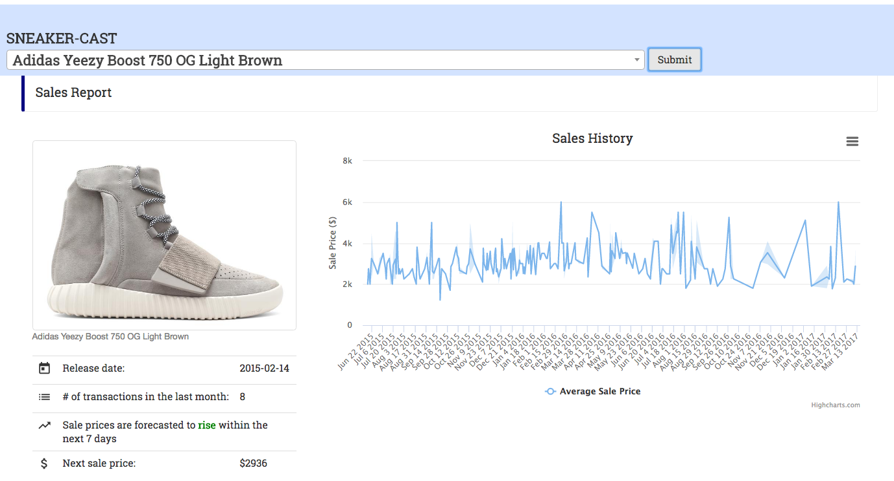

# sneaker-forecast-app

An app that predicts sneaker resale prices in the near-future.

A broad overview of this project:

The objectives are:
1. Predict prices on the resale market for the next 7 days
2. Collect important information about sneakers that can help inform buying or selling decisions

General tools and method can be broken into 3 parts:

**1. Data collection**
  * Combination of scrapy and selenium to collect information for this project
  * Pandas to clean and transform data for modelling 

**2. Linear regression**
  * scikit-learn for price prediction

**3. NLP**
  * Word2Vec for processing social media specific words
  * Gensim for sentiment analysis

**4. Web app**
  * Flask/javascript used to communicate results in the web app
  * HTML/CSS/Bootstrap for styling
